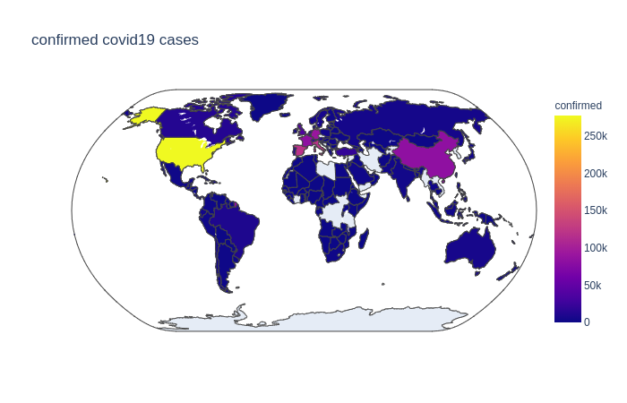
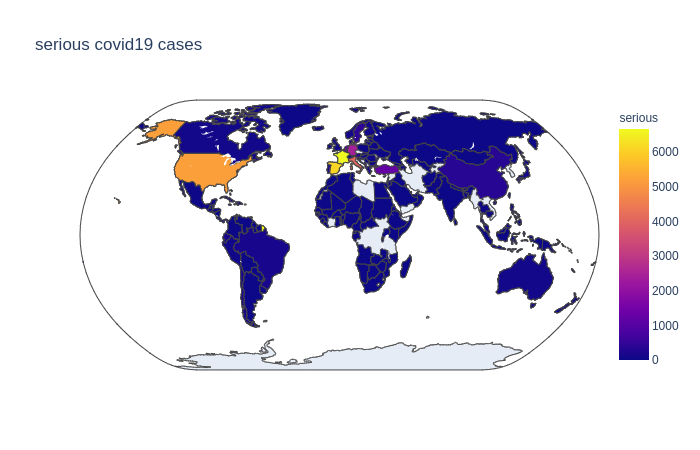
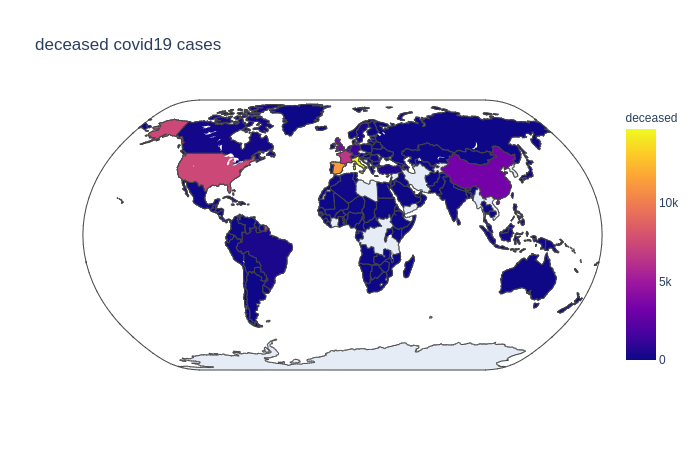

# covid19vis
A simple flask app to visualise the spread of corona worldwide.

Data used in this app is obtained from the links bellow.
## data sources
	1. https://thematicmapping.org/downloads/world_borders.php
	2. https://ncov2019.live/
    
